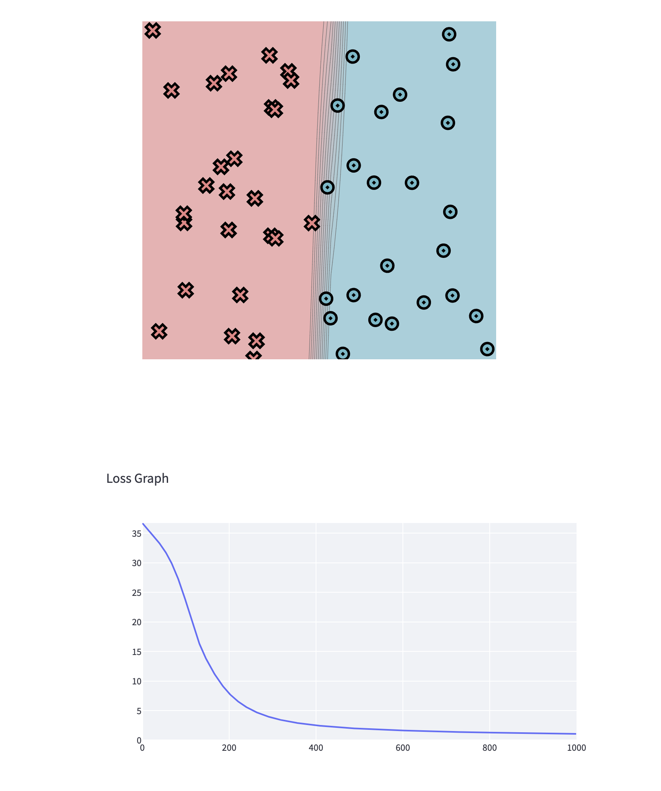
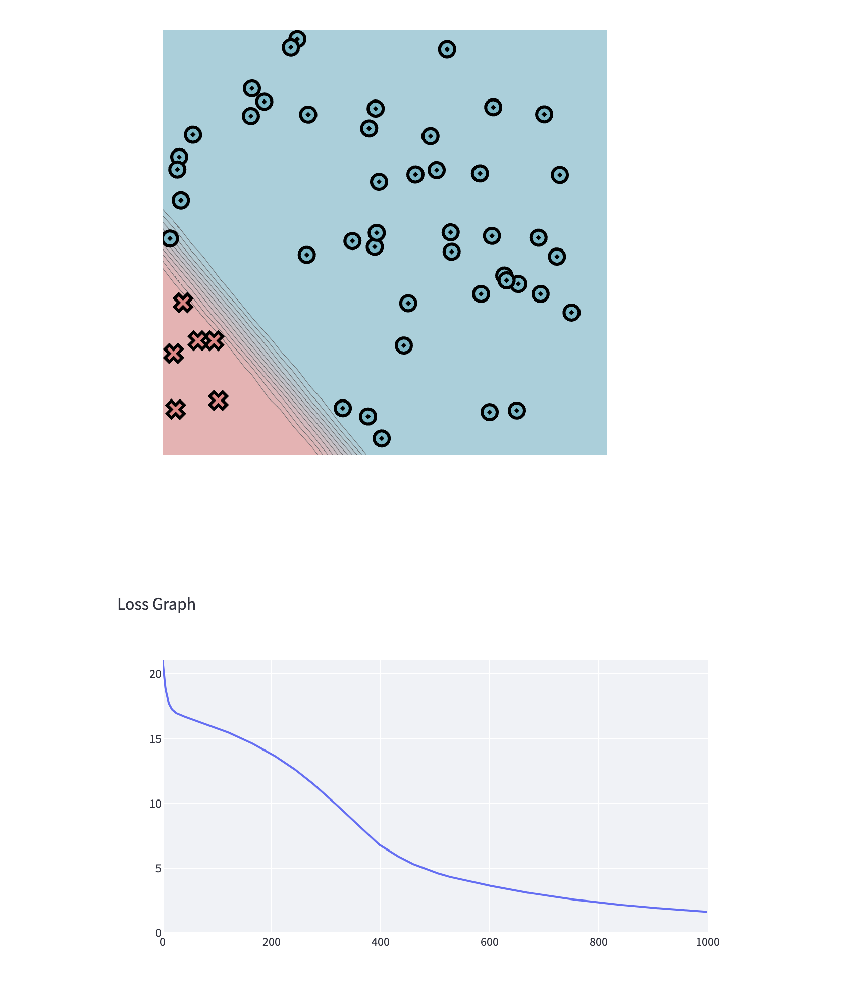
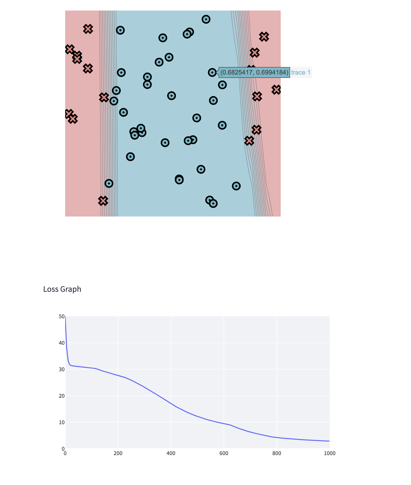
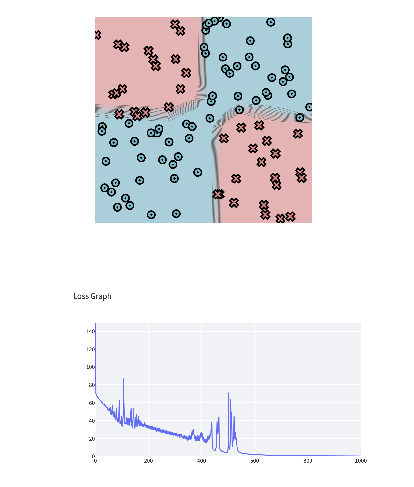

[](https://classroom.github.com/a/YFgwt0yY)

# MiniTorch Module 2


- Docs: https://minitorch.github.io/

- Overview: https://minitorch.github.io/module2/module2/

This assignment requires the following files from the previous assignments. You can get these by running

```bash
python sync_previous_module.py previous-module-dir current-module-dir
```

The files that will be synced are:

        minitorch/operators.py minitorch/module.py minitorch/autodiff.py minitorch/scalar.py minitorch/scalar_functions.py minitorch/module.py project/run_manual.py project/run_scalar.py project/datasets.py

# Task 2.5

## Simple Dataset



Time per epoch: 0.032s

<details>
<summary>Training Logs</summary>

```
Epoch: 0/1000, loss: 0, correct: 0
Epoch: 10/1000, loss: 35.90420407432422, correct: 6
Epoch: 20/1000, loss: 35.079033316362704, correct: 4
Epoch: 30/1000, loss: 34.24996248114335, correct: 38
Epoch: 40/1000, loss: 33.335379628967836, correct: 42
Epoch: 50/1000, loss: 32.309746694877134, correct: 44
Epoch: 60/1000, loss: 31.115775386498886, correct: 44
Epoch: 70/1000, loss: 29.676304461532045, correct: 45
Epoch: 80/1000, loss: 27.952443334471692, correct: 46
Epoch: 90/1000, loss: 25.972912827016348, correct: 47
Epoch: 100/1000, loss: 23.750628635368468, correct: 47
Epoch: 110/1000, loss: 21.356600302857174, correct: 47
Epoch: 120/1000, loss: 18.898606382963923, correct: 48
Epoch: 130/1000, loss: 16.80425108117409, correct: 47
Epoch: 140/1000, loss: 14.991669864885019, correct: 48
Epoch: 150/1000, loss: 13.461561244101865, correct: 47
Epoch: 160/1000, loss: 12.112754277121553, correct: 48
Epoch: 170/1000, loss: 10.891228371528342, correct: 49
Epoch: 180/1000, loss: 9.79974798968656, correct: 50
Epoch: 190/1000, loss: 8.836283601682254, correct: 49
Epoch: 200/1000, loss: 7.993589787368202, correct: 49
Epoch: 210/1000, loss: 7.272499824996041, correct: 49
Epoch: 220/1000, loss: 6.651659704186674, correct: 49
Epoch: 230/1000, loss: 6.110332808992939, correct: 49
Epoch: 240/1000, loss: 5.638178731674157, correct: 49
Epoch: 250/1000, loss: 5.225797627433285, correct: 49
Epoch: 260/1000, loss: 4.864758792937935, correct: 49
Epoch: 270/1000, loss: 4.5477355429507496, correct: 49
Epoch: 280/1000, loss: 4.268405964198986, correct: 49
Epoch: 290/1000, loss: 4.021360760427192, correct: 49
Epoch: 300/1000, loss: 3.8046090797049494, correct: 49
Epoch: 310/1000, loss: 3.6123453499599183, correct: 49
Epoch: 320/1000, loss: 3.4408020779655866, correct: 49
Epoch: 330/1000, loss: 3.286304069849681, correct: 49
Epoch: 340/1000, loss: 3.1466108055409534, correct: 49
Epoch: 350/1000, loss: 3.019854637600835, correct: 49
Epoch: 360/1000, loss: 2.9044531460917256, correct: 49
Epoch: 370/1000, loss: 2.79905179500413, correct: 49
Epoch: 380/1000, loss: 2.702486886023797, correct: 49
Epoch: 390/1000, loss: 2.613755144874165, correct: 49
Epoch: 400/1000, loss: 2.5319886525898903, correct: 49
Epoch: 410/1000, loss: 2.456434104374031, correct: 49
Epoch: 420/1000, loss: 2.3864355864293008, correct: 49
Epoch: 430/1000, loss: 2.321420223053431, correct: 49
Epoch: 440/1000, loss: 2.2608861736853623, correct: 49
Epoch: 450/1000, loss: 2.2043925604746453, correct: 49
Epoch: 460/1000, loss: 2.1515509871897187, correct: 49
Epoch: 470/1000, loss: 2.1020183743175433, correct: 49
Epoch: 480/1000, loss: 2.055490886456543, correct: 49
Epoch: 490/1000, loss: 2.0116987692298722, correct: 49
Epoch: 500/1000, loss: 1.970401946036631, correct: 49
Epoch: 510/1000, loss: 1.9313862516585563, correct: 49
Epoch: 520/1000, loss: 1.8944602013461787, correct: 49
Epoch: 530/1000, loss: 1.859452211545927, correct: 49
Epoch: 540/1000, loss: 1.8262082027086226, correct: 49
Epoch: 550/1000, loss: 1.7945895262825362, correct: 49
Epoch: 560/1000, loss: 1.7644711675503484, correct: 49
Epoch: 570/1000, loss: 1.7357401838245394, correct: 49
Epoch: 580/1000, loss: 1.7082943439930087, correct: 49
Epoch: 590/1000, loss: 1.682040940764863, correct: 49
Epoch: 600/1000, loss: 1.6568957514119187, correct: 49
Epoch: 610/1000, loss: 1.632782126501447, correct: 49
Epoch: 620/1000, loss: 1.609630189204041, correct: 49
Epoch: 630/1000, loss: 1.5873761303456995, correct: 49
Epoch: 640/1000, loss: 1.5659615865433556, correct: 50
Epoch: 650/1000, loss: 1.5453330905897937, correct: 50
Epoch: 660/1000, loss: 1.525441584795437, correct: 50
Epoch: 670/1000, loss: 1.5062419892988574, correct: 50
Epoch: 680/1000, loss: 1.48769281846409, correct: 50
Epoch: 690/1000, loss: 1.4697558394235548, correct: 50
Epoch: 700/1000, loss: 1.4523957676268318, correct: 50
Epoch: 710/1000, loss: 1.4355799949402577, correct: 50
Epoch: 720/1000, loss: 1.41927834642822, correct: 50
Epoch: 730/1000, loss: 1.4034628624497973, correct: 50
Epoch: 740/1000, loss: 1.3881076031363029, correct: 50
Epoch: 750/1000, loss: 1.3731884726874604, correct: 50
Epoch: 760/1000, loss: 1.35868306124491, correct: 50
Epoch: 770/1000, loss: 1.3445705023793801, correct: 50
Epoch: 780/1000, loss: 1.330831344468072, correct: 50
Epoch: 790/1000, loss: 1.317447434447514, correct: 50
Epoch: 800/1000, loss: 1.3044018126081234, correct: 50
Epoch: 810/1000, loss: 1.2916786172547428, correct: 50
Epoch: 820/1000, loss: 1.2792629981946624, correct: 50
Epoch: 830/1000, loss: 1.2671410381350012, correct: 50
Epoch: 840/1000, loss: 1.2552996811762076, correct: 50
Epoch: 850/1000, loss: 1.2437266676805512, correct: 50
Epoch: 860/1000, loss: 1.232410474875163, correct: 50
Epoch: 870/1000, loss: 1.2213402626201098, correct: 50
Epoch: 880/1000, loss: 1.210505823834427, correct: 50
Epoch: 890/1000, loss: 1.1998975391279072, correct: 50
Epoch: 900/1000, loss: 1.1895063352350306, correct: 50
Epoch: 910/1000, loss: 1.1793236468902166, correct: 50
Epoch: 920/1000, loss: 1.1693413818214495, correct: 50
Epoch: 930/1000, loss: 1.1595518885729255, correct: 50
Epoch: 940/1000, loss: 1.1499479268971178, correct: 50
Epoch: 950/1000, loss: 1.1405226404830526, correct: 50
Epoch: 960/1000, loss: 1.1312695318111154, correct: 50
Epoch: 970/1000, loss: 1.1221824389455979, correct: 50
Epoch: 980/1000, loss: 1.1132555140948155, correct: 50
Epoch: 990/1000, loss: 1.1044832037852843, correct: 50
Epoch: 1000/1000, loss: 1.0958602305112362, correct: 50
```

</details>

## Diagonal Dataset



Time per epoch: 0.062s

<details>
<summary>Training Logs</summary>

```
Epoch: 0/1000, loss: 0, correct: 0
Epoch: 10/1000, loss: 18.067171060256456, correct: 44
Epoch: 20/1000, loss: 17.166136145520994, correct: 44
Epoch: 30/1000, loss: 16.88163822757083, correct: 44
Epoch: 40/1000, loss: 16.714233375778253, correct: 44
Epoch: 50/1000, loss: 16.570419880638138, correct: 44
Epoch: 60/1000, loss: 16.430051428627248, correct: 44
Epoch: 70/1000, loss: 16.286291109435723, correct: 44
Epoch: 80/1000, loss: 16.13778844341151, correct: 44
Epoch: 90/1000, loss: 15.983267390896675, correct: 44
Epoch: 100/1000, loss: 15.82582235319403, correct: 44
Epoch: 110/1000, loss: 15.661813877884978, correct: 44
Epoch: 120/1000, loss: 15.490560495983729, correct: 44
Epoch: 130/1000, loss: 15.312042422944693, correct: 44
Epoch: 140/1000, loss: 15.12620182188596, correct: 44
Epoch: 150/1000, loss: 14.93168261620328, correct: 44
Epoch: 160/1000, loss: 14.728779546640721, correct: 44
Epoch: 170/1000, loss: 14.516772389280709, correct: 44
Epoch: 180/1000, loss: 14.295176407310159, correct: 44
Epoch: 190/1000, loss: 14.063432878192764, correct: 44
Epoch: 200/1000, loss: 13.820750228682298, correct: 44
Epoch: 210/1000, loss: 13.566284559594672, correct: 44
Epoch: 220/1000, loss: 13.299140029154906, correct: 44
Epoch: 230/1000, loss: 13.018382468362876, correct: 44
Epoch: 240/1000, loss: 12.723065299712248, correct: 44
Epoch: 250/1000, loss: 12.412271280816277, correct: 44
Epoch: 260/1000, loss: 12.085174739970059, correct: 44
Epoch: 270/1000, loss: 11.746011566812825, correct: 44
Epoch: 280/1000, loss: 11.395672870124757, correct: 44
Epoch: 290/1000, loss: 11.033945566468066, correct: 44
Epoch: 300/1000, loss: 10.661031168889007, correct: 44
Epoch: 310/1000, loss: 10.277769710884044, correct: 44
Epoch: 320/1000, loss: 9.88506751657827, correct: 44
Epoch: 330/1000, loss: 9.484409412388572, correct: 44
Epoch: 340/1000, loss: 9.07801833797837, correct: 44
Epoch: 350/1000, loss: 8.668774687190323, correct: 44
Epoch: 360/1000, loss: 8.262666838255356, correct: 45
Epoch: 370/1000, loss: 7.862660776097368, correct: 45
Epoch: 380/1000, loss: 7.470867516502129, correct: 46
Epoch: 390/1000, loss: 7.090580357641347, correct: 46
Epoch: 400/1000, loss: 6.763640355491374, correct: 46
Epoch: 410/1000, loss: 6.490548644064368, correct: 47
Epoch: 420/1000, loss: 6.228883451954784, correct: 47
Epoch: 430/1000, loss: 5.977166931785141, correct: 47
Epoch: 440/1000, loss: 5.735747769704597, correct: 48
Epoch: 450/1000, loss: 5.505875858809202, correct: 48
Epoch: 460/1000, loss: 5.314564556838853, correct: 48
Epoch: 470/1000, loss: 5.145094440067504, correct: 48
Epoch: 480/1000, loss: 4.9833629601837455, correct: 49
Epoch: 490/1000, loss: 4.827473696228324, correct: 49
Epoch: 500/1000, loss: 4.677082355923814, correct: 50
Epoch: 510/1000, loss: 4.534792643450145, correct: 50
Epoch: 520/1000, loss: 4.411628225795719, correct: 50
Epoch: 530/1000, loss: 4.3027334551360195, correct: 50
Epoch: 540/1000, loss: 4.201608213986504, correct: 50
Epoch: 550/1000, loss: 4.103372347600283, correct: 50
Epoch: 560/1000, loss: 4.00761414996174, correct: 50
Epoch: 570/1000, loss: 3.914324032909887, correct: 50
Epoch: 580/1000, loss: 3.8235661162455834, correct: 50
Epoch: 590/1000, loss: 3.7351679444232064, correct: 50
Epoch: 600/1000, loss: 3.649064703594365, correct: 50
Epoch: 610/1000, loss: 3.565195013769952, correct: 50
Epoch: 620/1000, loss: 3.4835004820270146, correct: 50
Epoch: 630/1000, loss: 3.4039254379327373, correct: 50
Epoch: 640/1000, loss: 3.3264166283585386, correct: 50
Epoch: 650/1000, loss: 3.2509229269609183, correct: 50
Epoch: 660/1000, loss: 3.177395073509191, correct: 50
Epoch: 670/1000, loss: 3.1057854446520152, correct: 50
Epoch: 680/1000, loss: 3.036047854502912, correct: 50
Epoch: 690/1000, loss: 2.9681373826744055, correct: 50
Epoch: 700/1000, loss: 2.9020102272381636, correct: 50
Epoch: 710/1000, loss: 2.8376235801238368, correct: 50
Epoch: 720/1000, loss: 2.77493552258817, correct: 50
Epoch: 730/1000, loss: 2.713904938546658, correct: 50
Epoch: 740/1000, loss: 2.6544914437388605, correct: 50
Epoch: 750/1000, loss: 2.596993717819621, correct: 50
Epoch: 760/1000, loss: 2.541313113768401, correct: 50
Epoch: 770/1000, loss: 2.4881712648423853, correct: 50
Epoch: 780/1000, loss: 2.4376718366386996, correct: 50
Epoch: 790/1000, loss: 2.38709257396442, correct: 50
Epoch: 800/1000, loss: 2.3396358817483476, correct: 50
Epoch: 810/1000, loss: 2.293675602966964, correct: 50
Epoch: 820/1000, loss: 2.2482940603408554, correct: 50
Epoch: 830/1000, loss: 2.2049946819719723, correct: 50
Epoch: 840/1000, loss: 2.1621878896545685, correct: 50
Epoch: 850/1000, loss: 2.1211652180334473, correct: 50
Epoch: 860/1000, loss: 2.080434727228818, correct: 50
Epoch: 870/1000, loss: 2.0413596023079874, correct: 50
Epoch: 880/1000, loss: 2.0033119861597495, correct: 50
Epoch: 890/1000, loss: 1.9661763739802005, correct: 50
Epoch: 900/1000, loss: 1.9305831136505163, correct: 50
Epoch: 910/1000, loss: 1.895899867503125, correct: 50
Epoch: 920/1000, loss: 1.862028536699022, correct: 50
Epoch: 930/1000, loss: 1.8289499186580187, correct: 50
Epoch: 940/1000, loss: 1.7966457147824464, correct: 50
Epoch: 950/1000, loss: 1.765097864290968, correct: 50
Epoch: 960/1000, loss: 1.7342885398314263, correct: 50
Epoch: 970/1000, loss: 1.7044593457776518, correct: 50
Epoch: 980/1000, loss: 1.6756998983840938, correct: 50
Epoch: 990/1000, loss: 1.6476205656398748, correct: 50
Epoch: 1000/1000, loss: 1.620190457634755, correct: 50
```

</details>

## Split Dataset



Time per epoch: 0.221s

<details>
<summary>Training Logs</summary>

```
Epoch: 0/1000, loss: 0, correct: 0
Epoch: 10/1000, loss: 34.73287430923782, correct: 20
Epoch: 20/1000, loss: 31.589056218099707, correct: 34
Epoch: 30/1000, loss: 31.261957348566355, correct: 34
Epoch: 40/1000, loss: 31.148495593204995, correct: 34
Epoch: 50/1000, loss: 31.048040588190624, correct: 34
Epoch: 60/1000, loss: 30.948275665755585, correct: 34
Epoch: 70/1000, loss: 30.845575569073496, correct: 34
Epoch: 80/1000, loss: 30.740657244971185, correct: 34
Epoch: 90/1000, loss: 30.629891595865878, correct: 34
Epoch: 100/1000, loss: 30.512415770151406, correct: 34
Epoch: 110/1000, loss: 30.373533871433903, correct: 34
Epoch: 120/1000, loss: 30.154586826413173, correct: 34
Epoch: 130/1000, loss: 29.780966047312756, correct: 34
Epoch: 140/1000, loss: 29.408751454297807, correct: 34
Epoch: 150/1000, loss: 29.139159677471547, correct: 34
Epoch: 160/1000, loss: 28.877468896029377, correct: 34
Epoch: 170/1000, loss: 28.61142416681429, correct: 35
Epoch: 180/1000, loss: 28.320238492326098, correct: 35
Epoch: 190/1000, loss: 28.038949124647527, correct: 36
Epoch: 200/1000, loss: 27.752306031824826, correct: 35
Epoch: 210/1000, loss: 27.45030882539072, correct: 37
Epoch: 220/1000, loss: 27.126852087938712, correct: 37
Epoch: 230/1000, loss: 26.77434037718997, correct: 37
Epoch: 240/1000, loss: 26.383201595719765, correct: 37
Epoch: 250/1000, loss: 25.938032573587325, correct: 37
Epoch: 260/1000, loss: 25.446097512650564, correct: 37
Epoch: 270/1000, loss: 24.934347621622596, correct: 39
Epoch: 280/1000, loss: 24.407258539170815, correct: 39
Epoch: 290/1000, loss: 23.846879963707003, correct: 39
Epoch: 300/1000, loss: 23.270841238653045, correct: 39
Epoch: 310/1000, loss: 22.70468233984007, correct: 40
Epoch: 320/1000, loss: 22.125005501662084, correct: 40
Epoch: 330/1000, loss: 21.53201366165153, correct: 41
Epoch: 340/1000, loss: 20.91893532480136, correct: 42
Epoch: 350/1000, loss: 20.286956479293792, correct: 43
Epoch: 360/1000, loss: 19.641071705637536, correct: 43
Epoch: 370/1000, loss: 18.985313908055677, correct: 43
Epoch: 380/1000, loss: 18.326886056936104, correct: 45
Epoch: 390/1000, loss: 17.685818364827895, correct: 45
Epoch: 400/1000, loss: 17.05957405992289, correct: 45
Epoch: 410/1000, loss: 16.45735849105319, correct: 45
Epoch: 420/1000, loss: 15.878860302474077, correct: 46
Epoch: 430/1000, loss: 15.334478997965734, correct: 46
Epoch: 440/1000, loss: 14.816499145261757, correct: 46
Epoch: 450/1000, loss: 14.324218485673457, correct: 46
Epoch: 460/1000, loss: 13.853478458142998, correct: 46
Epoch: 470/1000, loss: 13.409304250871775, correct: 46
Epoch: 480/1000, loss: 12.98762829002822, correct: 47
Epoch: 490/1000, loss: 12.593443708226955, correct: 47
Epoch: 500/1000, loss: 12.22555093908801, correct: 47
Epoch: 510/1000, loss: 11.875712628454616, correct: 47
Epoch: 520/1000, loss: 11.542174344975168, correct: 47
Epoch: 530/1000, loss: 11.22717287742981, correct: 47
Epoch: 540/1000, loss: 10.931462527394153, correct: 47
Epoch: 550/1000, loss: 10.651890289975162, correct: 47
Epoch: 560/1000, loss: 10.388828582450628, correct: 47
Epoch: 570/1000, loss: 10.138377692220296, correct: 48
Epoch: 580/1000, loss: 9.899565214974213, correct: 48
Epoch: 590/1000, loss: 9.67275901813013, correct: 48
Epoch: 600/1000, loss: 9.458625651044821, correct: 48
Epoch: 610/1000, loss: 9.254862918447998, correct: 48
Epoch: 620/1000, loss: 9.059543307264155, correct: 48
Epoch: 630/1000, loss: 8.77762513015864, correct: 48
Epoch: 640/1000, loss: 8.336791469453969, correct: 48
Epoch: 650/1000, loss: 7.940853599275372, correct: 48
Epoch: 660/1000, loss: 7.566683702197426, correct: 48
Epoch: 670/1000, loss: 7.212387065779623, correct: 48
Epoch: 680/1000, loss: 6.884129247206785, correct: 48
Epoch: 690/1000, loss: 6.5848033881368355, correct: 48
Epoch: 700/1000, loss: 6.304642053425759, correct: 48
Epoch: 710/1000, loss: 6.0430107688538035, correct: 49
Epoch: 720/1000, loss: 5.799778464706939, correct: 49
Epoch: 730/1000, loss: 5.574513814120731, correct: 49
Epoch: 740/1000, loss: 5.309623859707351, correct: 49
Epoch: 750/1000, loss: 5.045791363981143, correct: 49
Epoch: 760/1000, loss: 4.82708856337069, correct: 49
Epoch: 770/1000, loss: 4.64329746281373, correct: 49
Epoch: 780/1000, loss: 4.485034432328107, correct: 49
Epoch: 790/1000, loss: 4.347279383425944, correct: 50
Epoch: 800/1000, loss: 4.224622137048554, correct: 50
Epoch: 810/1000, loss: 4.114514824446949, correct: 50
Epoch: 820/1000, loss: 4.012795028543631, correct: 50
Epoch: 830/1000, loss: 3.91783642730394, correct: 50
Epoch: 840/1000, loss: 3.8288458495687774, correct: 50
Epoch: 850/1000, loss: 3.7449347542511355, correct: 50
Epoch: 860/1000, loss: 3.6656293600193934, correct: 50
Epoch: 870/1000, loss: 3.59048429703953, correct: 50
Epoch: 880/1000, loss: 3.5190274955307115, correct: 50
Epoch: 890/1000, loss: 3.4509893328679926, correct: 50
Epoch: 900/1000, loss: 3.386095260691007, correct: 50
Epoch: 910/1000, loss: 3.3241036075765704, correct: 50
Epoch: 920/1000, loss: 3.264801233138811, correct: 50
Epoch: 930/1000, loss: 3.207998321579766, correct: 50
Epoch: 940/1000, loss: 3.1535243049557167, correct: 50
Epoch: 950/1000, loss: 3.1012250882029635, correct: 50
Epoch: 960/1000, loss: 3.0509789123162703, correct: 50
Epoch: 970/1000, loss: 3.0026398069758704, correct: 50
Epoch: 980/1000, loss: 2.9560895188629615, correct: 50
Epoch: 990/1000, loss: 2.9111981066096444, correct: 50
Epoch: 1000/1000, loss: 2.8678729109875767, correct: 50
```

</details>

## XOR Dataset



Time per epoch: 0.628s

<details>
<summary>Training Logs</summary>

```
Epoch: 0/1000, loss: 0, correct: 0
Epoch: 10/1000, loss: 65.88361966622477, correct: 61
Epoch: 20/1000, loss: 62.5507707939281, correct: 69
Epoch: 30/1000, loss: 58.479051010954166, correct: 76
Epoch: 40/1000, loss: 55.362932073436035, correct: 76
Epoch: 50/1000, loss: 50.991431398598735, correct: 77
Epoch: 60/1000, loss: 46.20545173669946, correct: 87
Epoch: 70/1000, loss: 45.28044818594052, correct: 84
Epoch: 80/1000, loss: 46.78428301807141, correct: 78
Epoch: 90/1000, loss: 43.60236769138596, correct: 80
Epoch: 100/1000, loss: 33.50423872139705, correct: 86
Epoch: 110/1000, loss: 38.51631820043815, correct: 85
Epoch: 120/1000, loss: 36.212147661636635, correct: 84
Epoch: 130/1000, loss: 35.07248258316254, correct: 83
Epoch: 140/1000, loss: 31.54755479079774, correct: 85
Epoch: 150/1000, loss: 31.056732297910056, correct: 87
Epoch: 160/1000, loss: 34.915266724542334, correct: 82
Epoch: 170/1000, loss: 35.5628715698663, correct: 81
Epoch: 180/1000, loss: 33.02768014100234, correct: 82
Epoch: 190/1000, loss: 33.06975495192737, correct: 83
Epoch: 200/1000, loss: 31.43315311060985, correct: 84
Epoch: 210/1000, loss: 30.352666862354297, correct: 86
Epoch: 220/1000, loss: 28.97830992658129, correct: 87
Epoch: 230/1000, loss: 28.066792963020525, correct: 88
Epoch: 240/1000, loss: 27.714653982537207, correct: 86
Epoch: 250/1000, loss: 26.514876996651648, correct: 88
Epoch: 260/1000, loss: 26.25214271840608, correct: 89
Epoch: 270/1000, loss: 25.19872943600065, correct: 89
Epoch: 280/1000, loss: 24.45837730773555, correct: 89
Epoch: 290/1000, loss: 23.869121404622568, correct: 89
Epoch: 300/1000, loss: 23.49702914499396, correct: 89
Epoch: 310/1000, loss: 21.90639777719274, correct: 90
Epoch: 320/1000, loss: 21.660803813668682, correct: 89
Epoch: 330/1000, loss: 20.815836503924977, correct: 89
Epoch: 340/1000, loss: 19.95664193819359, correct: 90
Epoch: 350/1000, loss: 18.013910816406906, correct: 92
Epoch: 360/1000, loss: 18.181426824849353, correct: 90
Epoch: 370/1000, loss: 30.51729747910992, correct: 85
Epoch: 380/1000, loss: 16.67301277032253, correct: 93
Epoch: 390/1000, loss: 16.70190395126872, correct: 93
Epoch: 400/1000, loss: 21.911621530718264, correct: 90
Epoch: 410/1000, loss: 15.78638347098452, correct: 94
Epoch: 420/1000, loss: 15.302969761900718, correct: 94
Epoch: 430/1000, loss: 19.42229261524802, correct: 92
Epoch: 440/1000, loss: 36.05196085081225, correct: 88
Epoch: 450/1000, loss: 6.712566827895427, correct: 100
Epoch: 460/1000, loss: 25.300746408611246, correct: 87
Epoch: 470/1000, loss: 7.932450901117144, correct: 100
Epoch: 480/1000, loss: 5.278845100108909, correct: 100
Epoch: 490/1000, loss: 4.314779082157907, correct: 100
Epoch: 500/1000, loss: 6.7343926765625985, correct: 98
Epoch: 510/1000, loss: 29.719892369787427, correct: 83
Epoch: 520/1000, loss: 18.3808899560956, correct: 93
Epoch: 530/1000, loss: 18.13009217426576, correct: 92
Epoch: 540/1000, loss: 5.306581893879501, correct: 100
Epoch: 550/1000, loss: 3.7061297220449583, correct: 100
Epoch: 560/1000, loss: 3.143110556560818, correct: 100
Epoch: 570/1000, loss: 2.7490757100353855, correct: 100
Epoch: 580/1000, loss: 2.4492366620748673, correct: 100
Epoch: 590/1000, loss: 2.202196828226107, correct: 100
Epoch: 600/1000, loss: 2.002132817470181, correct: 100
Epoch: 610/1000, loss: 1.8320908408065777, correct: 100
Epoch: 620/1000, loss: 1.6863907284528892, correct: 100
Epoch: 630/1000, loss: 1.562707375569636, correct: 100
Epoch: 640/1000, loss: 1.4534805028464637, correct: 100
Epoch: 650/1000, loss: 1.3582515694140629, correct: 100
Epoch: 660/1000, loss: 1.2730703399361771, correct: 100
Epoch: 670/1000, loss: 1.1973347324518075, correct: 100
Epoch: 680/1000, loss: 1.1292584958086505, correct: 100
Epoch: 690/1000, loss: 1.068231854470819, correct: 100
Epoch: 700/1000, loss: 1.0128607304627113, correct: 100
Epoch: 710/1000, loss: 0.9623723852016014, correct: 100
Epoch: 720/1000, loss: 0.9161617625491941, correct: 100
Epoch: 730/1000, loss: 0.8737133937456726, correct: 100
Epoch: 740/1000, loss: 0.8346066435143276, correct: 100
Epoch: 750/1000, loss: 0.7984724333464923, correct: 100
Epoch: 760/1000, loss: 0.76499494492366, correct: 100
Epoch: 770/1000, loss: 0.7339693694105113, correct: 100
Epoch: 780/1000, loss: 0.7051139747994211, correct: 100
Epoch: 790/1000, loss: 0.6777917945369127, correct: 100
Epoch: 800/1000, loss: 0.6520739744318612, correct: 100
Epoch: 810/1000, loss: 0.6277290066672936, correct: 100
Epoch: 820/1000, loss: 0.6049942619855649, correct: 100
Epoch: 830/1000, loss: 0.5836215008701843, correct: 100
Epoch: 840/1000, loss: 0.5634889474032316, correct: 100
Epoch: 850/1000, loss: 0.5445441419394759, correct: 100
Epoch: 860/1000, loss: 0.5267039001919874, correct: 100
Epoch: 870/1000, loss: 0.5098858060191902, correct: 100
Epoch: 880/1000, loss: 0.49398391384983253, correct: 100
Epoch: 890/1000, loss: 0.4789272143060098, correct: 100
Epoch: 900/1000, loss: 0.4646546368749296, correct: 100
Epoch: 910/1000, loss: 0.45111023993525046, correct: 100
Epoch: 920/1000, loss: 0.4382392083582771, correct: 100
Epoch: 930/1000, loss: 0.4259986222894367, correct: 100
Epoch: 940/1000, loss: 0.4143442086807929, correct: 100
Epoch: 950/1000, loss: 0.4032379379053588, correct: 100
Epoch: 960/1000, loss: 0.3926420643190723, correct: 100
Epoch: 970/1000, loss: 0.38252606084609453, correct: 100
Epoch: 980/1000, loss: 0.3728592815685864, correct: 100
Epoch: 990/1000, loss: 0.3636128603875265, correct: 100
Epoch: 1000/1000, loss: 0.3547626090913824, correct: 100
```

</details>
